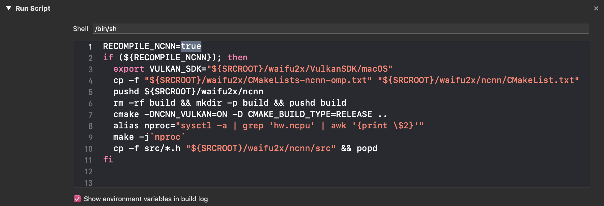
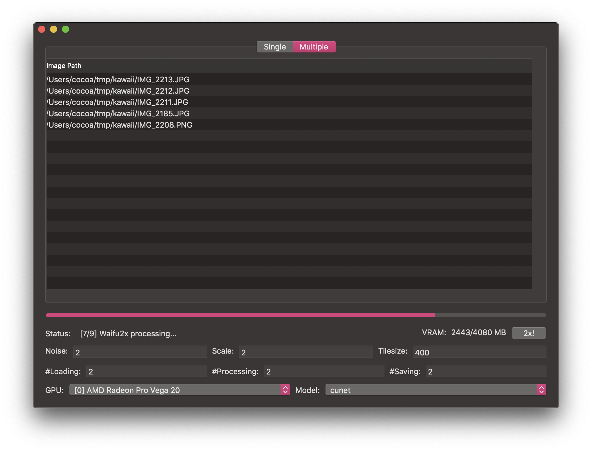

# waifu2x-ncnn-vulkan-macos
As its long long name suggested.

### Acknowledgement
- [waifu2x-ncnn-vulkan](https://github.com/nihui/waifu2x-ncnn-vulkan)
- [ncnn](https://github.com/Tencent/ncnn)
- [Vulkan SDK](https://vulkan.lunarg.com/sdk/home)

### Thanks
Thanks to [@shincurry](https://github.com/shincurry) for contributing to the UI of this project.

### Build Instructions
Download lastest Vulkan SDK at [https://vulkan.lunarg.com/sdk/home](https://vulkan.lunarg.com/sdk/home).

At the time of this README.md wrote, 1.2.131.2 was the newest version for macOS.

```bash
brew install protobuf

# clone this repo first
git clone --depth=1 https://github.com/BlueCocoa/waifu2x-ncnn-vulkan-macos

# download lastest Vulkan SDK
export VULKAN_SDK_VER="1.2.131.2"
wget https://sdk.lunarg.com/sdk/download/${VULKAN_SDK_VER}/mac/vulkansdk-macos-${VULKAN_SDK_VER}.tar.gz?Human=true -O vulkansdk-macos-${VULKAN_SDK_VER}.tar.gz
tar xf vulkansdk-macos-${VULKAN_SDK_VER}.tar.gz
rm -rf waifu2x-ncnn-vulkan-macos/waifu2x/VulkanSDK
mv vulkansdk-macos-${VULKAN_SDK_VER} waifu2x-ncnn-vulkan-macos/waifu2x/VulkanSDK

# clone Tencent/ncnn
git clone --depth=1 https://github.com/Tencent/ncnn ncnn

# clone nihui/waifu2x-ncnn-vulkan
# (At the time of writing) https://github.com/nihui/waifu2x-ncnn-vulkan/commit/ff7bc433612f4daf6a9fefcaa867b992b5c60196
rm -rf waifu2x-ncnn-vulkan-macos/waifu2x/waifu2x-ncnn-vulkan
git clone --depth=1 https://github.com/nihui/waifu2x-ncnn-vulkan waifu2x-ncnn-vulkan-macos/waifu2x/waifu2x-ncnn-vulkan

# check your cmake installation
which cmake
# if it goes with /Applications/CMake.app/Contents/bin/cmake
# then you need to install it in /usr/local/bin via follow command
sudo "/Applications/CMake.app/Contents/bin/cmake-gui" --install

# build ncnn
cp -f waifu2x-ncnn-vulkan-macos/waifu2x/CMakeLists-waifu2x-ncnn-vulkan.txt ncnn/CMakeLists.txt
rm -rf ncnn/build && mkdir -p ncnn/build && pushd ncnn/build
cmake -DNCNN_VULKAN=ON -D CMAKE_BUILD_TYPE=Release ..
make -j`sysctl -n hw.ncpu` && make install
cp -rf install/* ../../waifu2x-ncnn-vulkan-macos/waifu2x/ncnn

# compile waifu2x-ncnn-vulkan-macos
# and the compiled application will be placed at `build/Release/waifu2x-gui.app`
cd waifu2x-ncnn-vulkan-macos
xcodebuild
```

### Notice
After the first compilation, if you want to modify this project only, you may set those flags in `Build Phases -> Run Script` to `false` to avoid recompile ncnn and regenerate shader.



### Screenshot

#### Single Mode


#### Multiple Mode

