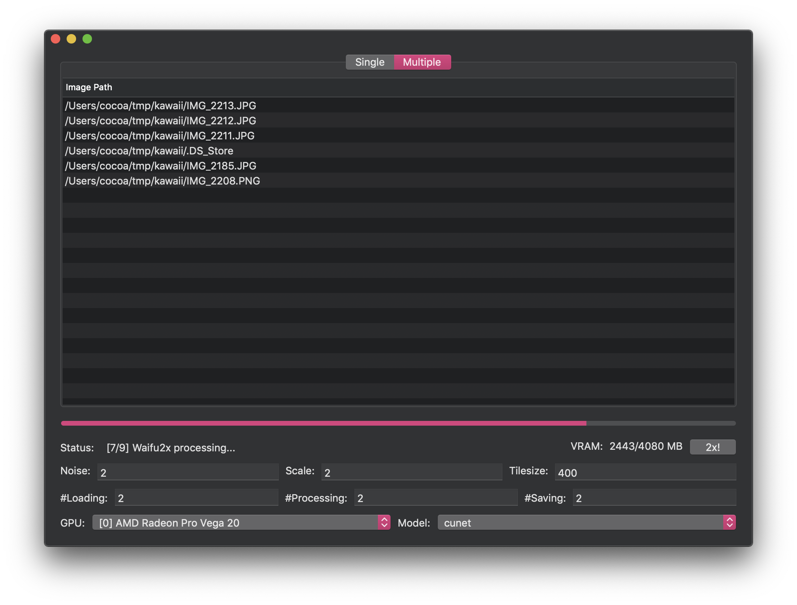
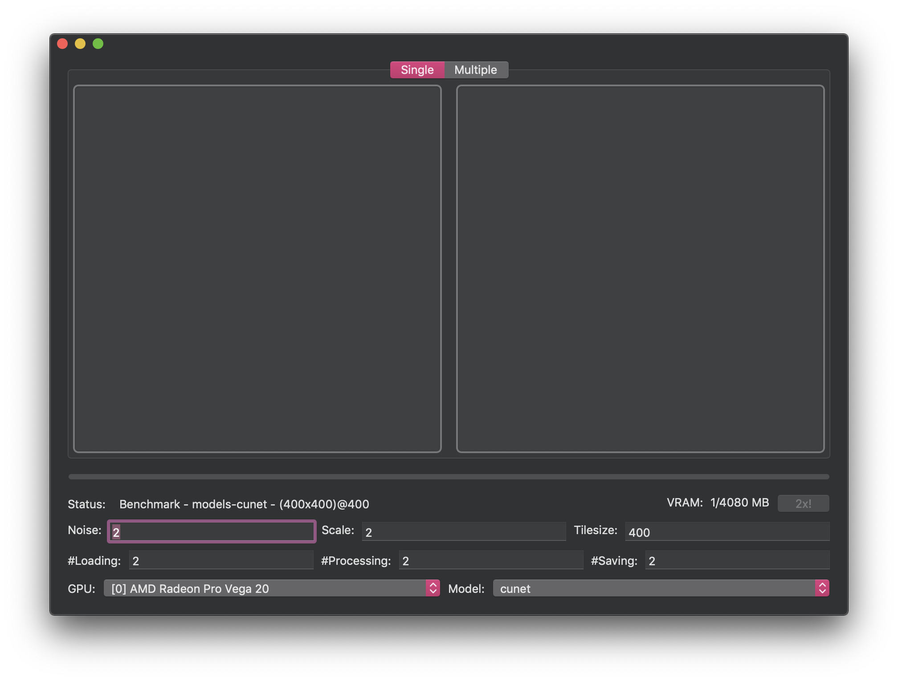

# waifu2x-ncnn-vulkan-macos
As its long long name suggested.

### Acknowledgement
- [waifu2x-ncnn-vulkan](https://github.com/nihui/waifu2x-ncnn-vulkan)
- [ncnn](https://github.com/Tencent/ncnn)
- [Vulkan SDK](https://vulkan.lunarg.com/sdk/home)

### Thanks
Thanks to [@shincurry](https://github.com/shincurry) for contributing to the UI of this project.

### Usage

#### Single Mode
1. Click `Single` on the top tab
2. Drag and drop the image you intentded to upscale to the left image cell
3. Adjust the settings at the bottom
4. Click `2x!` and the generated image will be shown at the right image cell
5. Drag the image from the right image cell to where you want to save it (the filename will be `waifu2x-output.png`)


#### Multiple Mode
1. Click `Multiple` on the top tab
2. Drag and drop images or directories to the table. (Only decodable images will be processed)
3. Adjust the settings at the bottom
4. Click `2x!` and the generated images will be saved at where them from with an extra `.png` extension. For example,

Input

```
.
├── 1
│   ├── IMG_2185.JPG
│   ├── IMG_2211.JPG
│   └── IMG_2212.JPG
├── 2
│   └── IMG_2208.PNG
└── IMG_2213.JPG
```

Output
```
.
.
├── 1
│   ├── IMG_2185.JPG
│   ├── IMG_2185.JPG.png
│   ├── IMG_2211.JPG
│   ├── IMG_2211.JPG.png
│   ├── IMG_2212.JPG
│   └── IMG_2212.JPG.png
├── 2
│   ├── IMG_2208.PNG
│   └── IMG_2208.PNG.png
├── IMG_2213.JPG
└── IMG_2213.JPG.png
```



#### Benchmark

To run benchmark, please click `waifu2x-gui` -> `Benchmark`



### Build Instructions
Download lastest Vulkan SDK at [https://vulkan.lunarg.com/sdk/home](https://vulkan.lunarg.com/sdk/home).

At the time of this README.md wrote, 1.2.131.2 was the newest version for macOS.

```bash
brew install protobuf

# clone this repo first
git clone --depth=1 https://github.com/BlueCocoa/waifu2x-ncnn-vulkan-macos

# download lastest Vulkan SDK
export VULKAN_SDK_VER="1.2.131.2"
wget https://sdk.lunarg.com/sdk/download/${VULKAN_SDK_VER}/mac/vulkansdk-macos-${VULKAN_SDK_VER}.tar.gz?Human=true -O vulkansdk-macos-${VULKAN_SDK_VER}.tar.gz
tar xf vulkansdk-macos-${VULKAN_SDK_VER}.tar.gz
rm -rf waifu2x-ncnn-vulkan-macos/waifu2x/VulkanSDK
mv vulkansdk-macos-${VULKAN_SDK_VER} waifu2x-ncnn-vulkan-macos/waifu2x/VulkanSDK

# clone Tencent/ncnn
git clone --depth=1 https://github.com/Tencent/ncnn ncnn

# clone nihui/waifu2x-ncnn-vulkan
# (At the time of writing) https://github.com/nihui/waifu2x-ncnn-vulkan/commit/ff7bc433612f4daf6a9fefcaa867b992b5c60196
rm -rf waifu2x-ncnn-vulkan-macos/waifu2x/waifu2x-ncnn-vulkan
git clone --depth=1 https://github.com/nihui/waifu2x-ncnn-vulkan waifu2x-ncnn-vulkan-macos/waifu2x/waifu2x-ncnn-vulkan

# check your cmake installation
which cmake
# if it goes with /Applications/CMake.app/Contents/bin/cmake
# then you need to install it in /usr/local/bin via follow command
sudo "/Applications/CMake.app/Contents/bin/cmake-gui" --install

# build ncnn
rm -rf ncnn/build && mkdir -p ncnn/build && pushd ncnn/build
cmake -DNCNN_VULKAN=ON -D CMAKE_BUILD_TYPE=Release ..
make -j`sysctl -n hw.ncpu` && make install
cp -rf install/* ../../waifu2x-ncnn-vulkan-macos/waifu2x/ncnn

# compile waifu2x-ncnn-vulkan-macos
# and the compiled application will be placed at `build/Release/waifu2x-gui.app`
cd waifu2x-ncnn-vulkan-macos
xcodebuild
```

### Notice
After the first compilation, if you want to modify this project only, you may set those flags in `Build Phases -> Run Script` to `false` to avoid recompile ncnn and regenerate shader.


## Speed Comparison between Macs

### Environment 1

- MacBook Pro 15-inch 2018
- macOS 10.14.6 (18G103)
- Intel Core i9 8950HK
- AMD Radeon Pro Vega 20

|Model|Image Size|Target Size|Block Size|Total Time(sec)|GPU Memory(MB)|
|---|---|---|---|---|---|
|models-cunet|200x200|400x400|400/200/100|0.47/0.43/0.49|613/613/172|
|models-cunet|400x400|800x800|400/200/100|0.97/0.88/0.95|2407/614/173|
|models-cunet|1000x1000|2000x2000|400/200/100|3.56/3.61/4.18|2415/617/175|
|models-cunet|2000x2000|4000x4000|400/200/100|12.72/13.22/15.49|2420/669/193|
|models-cunet|4000x4000|8000x8000|400/200/100|49.79/51.51/60.60|2452/645/197|
|models-upconv_7_anime_style_art_rgb|200x200|400x400|400/200/100|0.26/0.24/0.20|460/460/119|
|models-upconv_7_anime_style_art_rgb|400x400|800x800|400/200/100|0.47/0.40/0.40|1741/460/120|
|models-upconv_7_anime_style_art_rgb|1000x1000|2000x2000|400/200/100|1.67/1.64/1.73|1765/463/121|
|models-upconv_7_anime_style_art_rgb|2000x2000|4000x4000|400/200/100|6.12/6.11/6.49|1769/466/122|
|models-upconv_7_anime_style_art_rgb|4000x4000|8000x8000|400/200/100|23.75/23.71/25.27|1801/489/142|

### Environment 2

- MacBook Pro 15-inch 2018
- macOS 10.14.6 (18G84)
- Intel Core i9 8850HK
- AMD Radeon 560X

|Model|Image Size|Target Size|Block Size|Total Time(sec)|GPU Memory(MB)|
|---|---|---|---|---|---|
|models-cunet|200x200|400x400|400/200/100|2.00/0.53/0.56|613/613/172|
|models-cunet|400x400|800x800|400/200/100|1.29/1.18/1.26|2407/614/173|
|models-cunet|1000x1000|2000x2000|400/200/100|5.20/5.17/5.85|2415/617/175|
|models-cunet|2000x2000|4000x4000|400/200/100|19.07/19.35/22.25|2420/669/193|
|models-cunet|4000x4000|8000x8000|400/200/100|74.49/76.73/88.12|2452/644/197|
|models-upconv_7_anime_style_art_rgb|200x200|400x400|400/200/100|0.31/0.27/0.27|460/460/119|
|models-upconv_7_anime_style_art_rgb|400x400|800x800|400/200/100|0.65/0.54/0.55|1741/460/119|
|models-upconv_7_anime_style_art_rgb|1000x1000|2000x2000|400/200/100|2.41/2.34/2.48|1765/463/121|
|models-upconv_7_anime_style_art_rgb|2000x2000|4000x4000|400/200/100|8.74/8.84/9.43|1769/466/122|
|models-upconv_7_anime_style_art_rgb|4000x4000|8000x8000|400/200/100|32.66/33.00/35.29|1801/489/142|

### Environment 3

- MacBook Pro 15-inch 2018
- macOS 10.14.6 (18G103)
- Intel Core i9 8950HK
- Intel UHD Graphics 630

|Model|Image Size|Target Size|Block Size|Total Time(sec)|GPU Memory(MB)|
|---|---|---|---|---|---|
|models-cunet|200x200|400x400|400/200/100|0.95/0.99/0.87|616/616/176|
|models-cunet|400x400|800x800|400/200/100|2.53/2.27/2.48|2408/616/176|
|models-cunet|1000x1000|2000x2000|400/200/100|12.40/12.00/13.31|2408/616/176|
|models-cunet|2000x2000|4000x4000|400/200/100|44.50/46.81/52.13|2408/669/196|
|models-cunet|4000x4000|8000x8000|400/200/100|175.64/185.56/222.58|2431/637/196|
|models-upconv_7_anime_style_art_rgb|200x200|400x400|400/200/100|1.07/1.27/0.83|466/466/125|
|models-upconv_7_anime_style_art_rgb|400x400|800x800|400/200/100|2.30/1.09/1.11|1746/466/125|
|models-upconv_7_anime_style_art_rgb|1000x1000|2000x2000|400/200/100|6.30/5.70/5.92|1762/466/125|
|models-upconv_7_anime_style_art_rgb|2000x2000|4000x4000|400/200/100|22.12/22.48/23.71|1762/466/125|
|models-upconv_7_anime_style_art_rgb|4000x4000|8000x8000|400/200/100|87.28/89.11/93.98|1780/482/141|

### Environment 4

- MacBook 12-inch Early 2016
- macOS 10.14.6 (18G84)
- Intel Core m7 6Y75
- Intel HD Graphics 515

|Model|Image Size|Target Size|Block Size|Total Time(sec)|GPU Memory(MB)|
|---|---|---|---|---|---|
|models-cunet|200x200|400x400|400/200/100|1.12/1.41/1.23|616/616/176|
|models-cunet|400x400|800x800|400/200/100|3.06/2.90/3.34|2408/616/176|
|models-cunet|1000x1000|2000x2000|400/200/100|18.29/17.81/19.89|2408/616/176|
|models-cunet|2000x2000|4000x4000|400/200/100|66.55/71.79/85.83|2408/665/196|
|models-cunet|4000x4000|8000x8000|400/200/100|288.38/337.44/385.85|2431/637/196|
|models-upconv_7_anime_style_art_rgb|200x200|400x400|400/200/100|0.63/0.69/0.53|466/466/125|
|models-upconv_7_anime_style_art_rgb|400x400|800x800|400/200/100|1.62/1.43/1.47|1746/466/125|
|models-upconv_7_anime_style_art_rgb|1000x1000|2000x2000|400/200/100|9.19/9.06/9.46|1762/466/125|
|models-upconv_7_anime_style_art_rgb|2000x2000|4000x4000|400/200/100|35.52/37.66/41.57|1762/466/125|
|models-upconv_7_anime_style_art_rgb|4000x4000|8000x8000|400/200/100|199.20/182.04/159.11|1780/482/141|

## Speed Comparison (not really) with waifu2x-caffe-cui & waifu2x-ncnn-vulkan

### Environment (waifu2x-caffe-cui & waifu2x-ncnn-vulkan)

- Windows 10 1809
- AMD R7-1700
- Nvidia GTX-1070
- Nvidia driver 419.67
- CUDA 10.1.105
- cuDNN 10.1

### Environment (waifu2x-ncnn-vulkan-macos)

- macOS 10.14.6 (18G103)
- Intel Core i9 8950HK
- AMD Radeon Pro Vega 20

### cunet

||Image Size|Target Size|Block Size|Total Time(s)|GPU Memory(MB)|
|---|---|---|---|---|---|
|waifu2x-ncnn-vulkan-macOS|200x200|400x400|400/200/100|0.46/0.44/0.43|621/621/180|
|waifu2x-ncnn-vulkan|200x200|400x400|400/200/100|0.86/0.86/0.82|638/638/197|
|waifu2x-caffe-cui|200x200|400x400|400/200/100|2.54/2.39/2.36|3017/936/843|
|waifu2x-ncnn-vulkan-macOS|400x400|800x800|400/200/100|0.91/0.84/0.92|2415/621/180|
|waifu2x-ncnn-vulkan|400x400|800x800|400/200/100|1.17/1.04/1.02|2430/638/197|
|waifu2x-caffe-cui|400x400|800x800|400/200/100|2.91/2.43/2.7|3202/1389/1178|
|waifu2x-ncnn-vulkan-macOS|1000x1000|2000x2000|400/200/100|3.54/3.58/4.18|2422/624/182|
|waifu2x-ncnn-vulkan|1000x1000|2000x2000|400/200/100|2.35/2.26/2.46|2430/638/197|
|waifu2x-caffe-cui|1000x1000|2000x2000|400/200/100|4.04/3.79/4.35|3258/1582/1175|
|waifu2x-ncnn-vulkan-macOS|2000x2000|4000x4000|400/200/100|12.83/13.25/15.44|2426/676/200|
|waifu2x-ncnn-vulkan|2000x2000|4000x4000|400/200/100|6.46/6.59/7.49|2430/686/213|
|waifu2x-caffe-cui|2000x2000|4000x4000|400/200/100|7.01/7.54/10.11|3258/1499/1200|
|waifu2x-ncnn-vulkan-macOS|4000x4000|8000x8000|400/200/100|49.56/51.44/60.56|2459/651/203|
|waifu2x-ncnn-vulkan|4000x4000|8000x8000|400/200/100|22.78/23.78/27.61|2448/654/213|
|waifu2x-caffe-cui|4000x4000|8000x8000|400/200/100|18.45/21.85/31.82|3325/1652/1236|

### upconv_7_anime_style_art_rgb

||Image Size|Target Size|Block Size|Total Time(s)|GPU Memory(MB)|
|---|---|---|---|---|---|
|waifu2x-ncnn-vulkan-macOS|200x200|400x400|400/200/100|0.23/0.20/0.22|465/465/125|
|waifu2x-ncnn-vulkan|200x200|400x400|400/200/100|0.74/0.75/0.72|482/482/142|
|waifu2x-caffe-cui|200x200|400x400|400/200/100|2.04/1.99/1.99|995/546/459|
|waifu2x-ncnn-vulkan-macOS|400x400|800x800|400/200/100|0.49/0.42/0.41|1747/466/125|
|waifu2x-ncnn-vulkan|400x400|800x800|400/200/100|0.95/0.83/0.81|1762/482/142|
|waifu2x-caffe-cui|400x400|800x800|400/200/100|2.08/2.12/2.11|995/546/459|
|waifu2x-ncnn-vulkan-macOS|1000x1000|2000x2000|400/200/100|1.67/1.60/1.68|1770/468/127|
|waifu2x-ncnn-vulkan|1000x1000|2000x2000|400/200/100|1.52/1.41/1.44|1778/482/142|
|waifu2x-caffe-cui|1000x1000|2000x2000|400/200/100|2.72/2.60/2.68|1015/570/459|
|waifu2x-ncnn-vulkan-macOS|2000x2000|4000x4000|400/200/100|6.11/5.89/6.18|1774/472/128|
|waifu2x-ncnn-vulkan|2000x2000|4000x4000|400/200/100|3.45/3.42/3.63|1778/482/142|
|waifu2x-caffe-cui|2000x2000|4000x4000|400/200/100|3.90/4.01/4.35|1015/521/462|
|waifu2x-ncnn-vulkan-macOS|4000x4000|8000x8000|400/200/100|22.92/22.70/24.16|1806/495/147|
|waifu2x-ncnn-vulkan|4000x4000|8000x8000|400/200/100|11.16/11.29/12.07|1796/498/158|
|waifu2x-caffe-cui|4000x4000|8000x8000|400/200/100|9.24/9.81/11.16|995/546/436|

