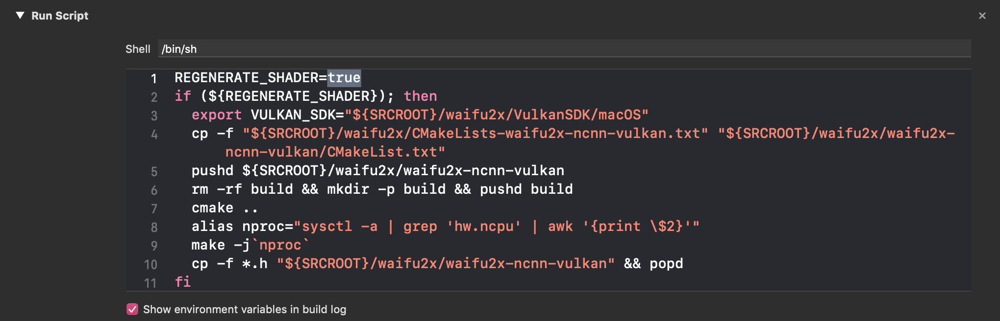
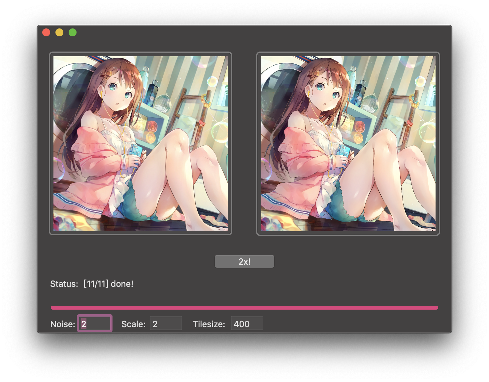

# waifu2x-ncnn-vulkan-macos
As its long long name suggested.

### Acknowledgement
- [waifu2x-ncnn-vulkan](https://github.com/nihui/waifu2x-ncnn-vulkan)
- [ncnn](https://github.com/Tencent/ncnn)
- [Vulkan SDK](https://vulkan.lunarg.com/sdk/home)

### Build Instructions
Download lastest Vulkan SDK at [https://vulkan.lunarg.com/sdk/home](https://vulkan.lunarg.com/sdk/home).

At the time of this README.md wrote, 1.1.106.0 was the newest version for macOS.

```bash
# to enable OpenMP
brew install llvm libomp

# clone this repo first
git clone --depth=1 https://github.com/BlueCocoa/waifu2x-ncnn-vulkan-macos

# download lastest Vulkan SDK
export VULKAN_SDK_VER="1.1.106.0"
wget https://sdk.lunarg.com/sdk/download/${VULKAN_SDK_VER}/mac/vulkansdk-macos-${VULKAN_SDK_VER}.tar.gz?Human=true -O vulkansdk-macos-${VULKAN_SDK_VER}.tar.gz
tar xf vulkansdk-macos-${VULKAN_SDK_VER}.tar.gz
cp -rfP vulkansdk-macos-${VULKAN_SDK_VER}/ waifu2x-ncnn-vulkan-macos/waifu2x/VulkanSDK

# clone Tencent/ncnn
git clone --depth=1 https://github.com/Tencent/ncnn ncnn
cp -rfP ncnn/* waifu2x-ncnn-vulkan-macos/waifu2x/ncnn

# clone nihui/waifu2x-ncnn-vulkan
git clone --depth=1 https://github.com/nihui/waifu2x-ncnn-vulkan waifu2x-ncnn-vulkan
cp -rfP waifu2x-ncnn-vulkan/* waifu2x-ncnn-vulkan-macos/waifu2x/waifu2x-ncnn-vulkan

# compile waifu2x-ncnn-vulkan-macos
# and the compiled application will be placed at `build/Release/waifu2x-gui.app`
cd waifu2x-ncnn-vulkan-macos
xcodebuild
```

### Notice
After the first compilation, you may set those flags in `Build Phases -> Run Script` to false to avoid recompile ncnn and regenerate shader.




### Screenshot


